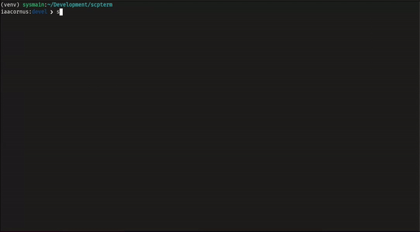

# scpterm

Access the SCP Foundation database from your terminal.

# Installation

Since this is still in alpha stage, although it is not that buggy, you can download the source code and include `alias scp="python <parent_dir>/src/cli.py"`, in your prompt, until `setup.py` is still not available.

# Usage

[](samples/sample_1.gif)

```
usage: scp [COMMAND] [OPTIONS] [INPUT]

scpterm, a view classified information of SCP Foundation's anomalies in your terminal.

options:
  -h, --help            show this help message and exit
  -init, --initiate     Initiate the database.
  -r, --re              Do again the previous task
  -fetch, --fetch       Fetch new data from the database.
  -d DECODE, --decode DECODE
                        View the information of anomaly.
  -l, --list            List all available anomaly.
  -v, --version         Show the version number of the software as well as other information
```

Initiate the SCP database from [https://the-scp.foundation/](https://the-scp.foundation/), with `scp -init`, preferably, only do this once, to avoid sending unnecessary requests to the server.

This may take a while, but after the process, you can list the all locally available anomaly:

```
$ scp -l
[23:08:10] > SCP-001@ https//the-scp.foundation/object/scp-001                                                          scp_utils.py:90
           > SCP-002@ https//the-scp.foundation/object/scp-002                                                          scp_utils.py:90
           > SCP-003@ https//the-scp.foundation/object/scp-003                                                          scp_utils.py:90
           > SCP-004@ https//the-scp.foundation/object/scp-004                                                          scp_utils.py:90
           > SCP-005@ https//the-scp.foundation/object/scp-005                                                          scp_utils.py:90
           > SCP-007@ https//the-scp.foundation/object/scp-007                                                          scp_utils.py:90
           > SCP-009@ https//the-scp.foundation/object/scp-009                                                          scp_utils.py:90
           [+] There are total of 7 anomalies in the local database.                                                    scp_utils.py:93
           [?] There anomalies are located at database/anomalies.list/:database/proc.anomalies.d/

```

And view the information about selected anomaly with `scp -d <scp number>`, e.g. `scp -d 002`:

# License

[Licensed to GNU General Public License version 3.0](LICENSE)
