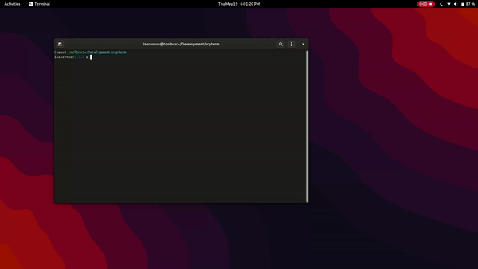

# Secure. Contain. Protect (SCP) Terminal

](https://img.shields.io/github/license/iaacornus/scpterm)
](https://img.shields.io/github/stars/iaacornus/scpterm)
](https://img.shields.io/github/issues/iaacornus/scpterm)
](https://api.codiga.io/project/33613/score/svg)
[](https://img.shields.io/github/release/iaacornus/scpterm?include_prereleases)

Access the SCP Foundation database from your terminal.

# Installation

## `whl` install

The project can be installed using the `.whl` provided in the [releases](https://github.com/iaacornus/scpterm/releases), verify its `sha256` checksum for security, then using `python-pip`, the project can be installed: `pip install scp*.whl`.

## Source compilation

Clone or download the project repository, either via GUI or `git clone --branch <prefered branch> https://github.com/iaacornus/scpterm`, and build the project from source using `cd scpterm && python -m build`.

# Usage

[](samples/0.2.0.gif)

```
usage: scp [COMMAND] [OPTIONS] [INPUT]

scpterm, a view classified information of SCP Foundation's anomalies in your terminal.

options:
  -h, --help            show this help message and exit
  -init, --initiate     Initiate the database.
  -r, --re              Do again the previous task
  -d DECODE, --decode DECODE
                        View the information of anomaly.
  -I IMAGE, --image IMAGE
                        Display the image of the anomaly.
  -l, --list            List all available anomaly.
  -v, --version         Show the version number of the software as well as other information.
```

Initiate the SCP database from [https://the-scp.foundation/](https://the-scp.foundation/), with `scp -init`, preferably, only do this once, to avoid sending unnecessary requests to the server.

This may take a while, but after the process, you can list the all locally available anomaly:

```
$ scp -l
[18:06:52] > SCP-001@ https//the-scp.foundation//object/scp-001                    scp_utils.py:207
           > SCP-002@ https//the-scp.foundation//object/scp-002                    scp_utils.py:207
           > SCP-003@ https//the-scp.foundation//object/scp-003                    scp_utils.py:207
           > SCP-004@ https//the-scp.foundation//object/scp-004                    scp_utils.py:207
           > SCP-005@ https//the-scp.foundation//object/scp-005                    scp_utils.py:207
           > SCP-006@ https//the-scp.foundation//object/scp-006                    scp_utils.py:207
           > SCP-007@ https//the-scp.foundation//object/scp-007                    scp_utils.py:207
           > SCP-008@ https//the-scp.foundation//object/scp-008                    scp_utils.py:207
           > SCP-008@ https//the-scp.foundation/object/scp-008                     scp_utils.py:207
           > SCP-009@ https//the-scp.foundation/object/scp-009                     scp_utils.py:207
           > SCP-010@ https//the-scp.foundation/object/scp-010                     scp_utils.py:207
           [+] There are total of 10 anomalies in the local database.              scp_utils.py:210
           [?] The anomalies are located at database/anomalies.list/:database/proc.anomalies.d/
```

And view the information about selected anomaly with `scp -d <scp number>`, e.g. `scp -d 002`:

# Todo

- [ ] Update function to fetch updates for repository.
- [ ] Improve the information display system
- [X] Add image display support
- [ ] Link related video to SCP
- [ ] Add user setup/login before access
- [X] Add search function for unlisted SCP

# License

[Licensed to GNU General Public License version 3.0](LICENSE)
